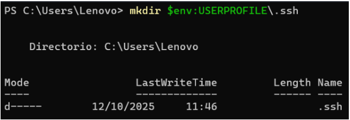
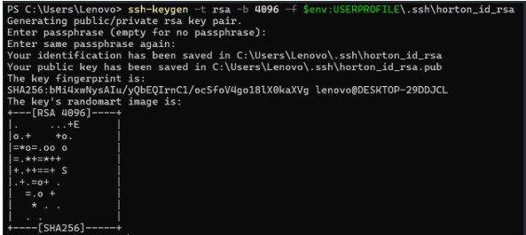
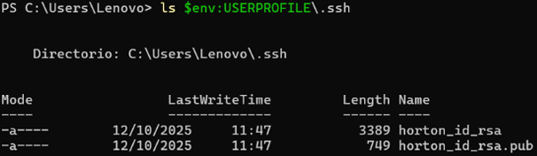
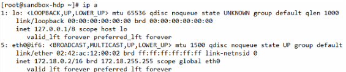
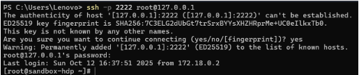
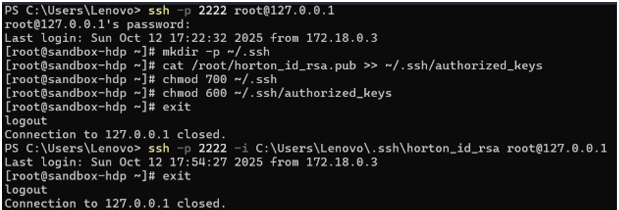

# 10. IMPLEMENTACIÓN TÉCNICA EN HORTONWORKS

## 10.1. Ingesta inicial a HDFS

En esta sección se describe el procedimiento realizado para la ingesta inicial de archivos al sistema distribuido de archivos de Hadoop (HDFS) dentro del entorno Hortonworks.  

El objetivo es automatizar la transferencia de archivos locales (en formatos .csv y .xlsx) hacia la zona /data/raw/ del HDFS, garantizando trazabilidad y reproducibilidad del proceso.  

---

### 10.1.1. Configuración de conexión SSH entre host y Hortonworks

Para establecer una comunicación segura entre la máquina anfitriona (Windows) y la máquina virtual (Hortonworks Sandbox), se configuró un acceso mediante llaves SSH.  

**PASO 1: Creación de la carpeta para almacenar la llave**  
Código:
```bash
mkdir $env:USERPROFILE\.ssh  
```
Ejecución:  
 

---

**PASO 2: Generación de las llaves RSA de 4096 bits**  
Código:
```bash
ssh-keygen -t rsa -b 4096 -f $env:USERPROFILE\.ssh\horton_id_rsa  
```

Ejecución:  
  

---

**PASO 3: Verificación de los archivos generados**  
Código:
```bash  
ls $env:USERPROFILE\.ssh  
```

Ejecución:  
 

Donde:  
- horton_id_rsa corresponde a la llave privada, almacenada localmente.  
- horton_id_rsa.pub es la llave pública, que se copia al servidor remoto.  

---

**PASO 4: Obtención de la dirección IP de la máquina virtual**  
Código:
```bash  
ip a  
```

Ejecución:  
 

---

**PASO 5: Conexión al entorno virtual Hortonworks desde PowerShell**  
Código:
```bash  
ssh -p 2222 root@127.0.0.1  
```

Ejecución:  


---

**PASO 6: Registro de la llave pública en la VM**  
Código:
```bash  
mkdir -p ~/.ssh  
cat /root/horton_id_rsa.pub >> ~/.ssh/authorized_keys  
chmod 700 ~/.ssh  
chmod 600 ~/.ssh/authorized_keys  
```

Ejecución:  
  

---

### 10.1.2. Automatización de carga con script Python

Para optimizar la carga de archivos al HDFS, se desarrolló un script en Python denominado subir_a_hdfs.py.  

Este script automatiza la conversión de archivos Excel a CSV, la transferencia a la máquina virtual mediante scp, y finalmente la carga en HDFS.  

**Código:

```python  
Importación de librerías  
import os  
import re  
import unicodedata  
import subprocess  
import pandas as pd  

Configuración de parámetros  
KEY_PATH = r"C:\Users\Lenovo\.ssh\horton_id_rsa"  
LOCAL_DIR = r"C:\Inteligencia_Negocios\Archivos\Descargados"  
REMOTE_DIR = "/root/hdfs_upload"  
HDFS_DIR = "/data/raw/"  
SSH_CONN = "root@127.0.0.1"  
SSH_PORT = "2222"  
```
---

### 10.1.3. Conversión de archivos Excel a CSV

El script incluye una función que normaliza nombres de archivos y convierte las hojas de Excel en archivos CSV independientes, preservando las tildes y caracteres especiales.  

```python 
def limpiar_nombre(nombre):  
 nfkd = unicodedata.normalize("NFKD", nombre)  
 sin_tildes = "".join([c for c in nfkd if not unicodedata.combining(c)])  
 sin_espacios = sin_tildes.replace(" ", "_")  
 limpio = re.sub(r"[^A-Za-z0-9._-]", "", sin_espacios)  
 return limpio  

Cada archivo Excel (.xls o .xlsx) es procesado hoja por hoja y exportado a formato CSV:  

📄 Convirtiendo archivos Excel a CSV...  

converted_files = []  
for f in files:  
 path = os.path.join(LOCAL_DIR, f)  
 if f.endswith((".xls", ".xlsx")):  
  print(f" -> {f}")  
  xls = pd.ExcelFile(path)  
  for sheet in xls.sheet_names:  
   df = pd.read_excel(xls, sheet_name=sheet)  
   clean_sheet = limpiar_nombre(sheet)  
   new_name = limpiar_nombre(f"{os.path.splitext(f)[0]}_{clean_sheet}.csv")  
   new_path = os.path.join(LOCAL_DIR, new_name)  
   df.to_csv(new_path, index=False)  
   converted_files.append(new_name)  
   print(f" |-> Hoja '{sheet}' -> {new_name}")  
 else:  
  converted_files.append(f)  
```
---

### 10.1.4. Subida automática a HDFS y verificación

Una vez convertidos los archivos, el script automatiza su transferencia y posterior carga al HDFS.  

**Copia de archivos a la máquina virtual:**  
```python 
🚚 Copiando archivos a la VM (sandbox)...  

subprocess.run(  
 ["ssh", "-p", SSH_PORT, "-i", KEY_PATH, SSH_CONN, f"mkdir -p {REMOTE_DIR}"],  
 check=True,  
)  

for f in converted_files:  
 local_path = os.path.join(LOCAL_DIR, f)  
 print(f"→ Subiendo {f}")  
 subprocess.run(  
  [  
   "scp",  
   "-P",  
   SSH_PORT,  
   "-i",  
   KEY_PATH,  
   local_path,  
   f"{SSH_CONN}:{REMOTE_DIR}/",  
  ],  
 check=True,  
 )  
```
**Creación de carpeta en HDFS y carga final:**  
```python 
📦 Subiendo archivos al HDFS...  

cmd_create_dir = f"hdfs dfs -mkdir -p {HDFS_DIR}"  
cmd_put = f'for f in {REMOTE_DIR}/*; do hdfs dfs -put -f "$f" {HDFS_DIR}; done'  

subprocess.run(  
 ["ssh", "-p", SSH_PORT, "-i", KEY_PATH, SSH_CONN, cmd_create_dir], check=True  
)  
subprocess.run(["ssh", "-p", SSH_PORT, "-i", KEY_PATH, SSH_CONN, cmd_put], check=True)  

✅ ¡Archivos subidos correctamente a HDFS en /data/raw/!  
```