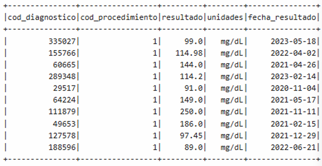
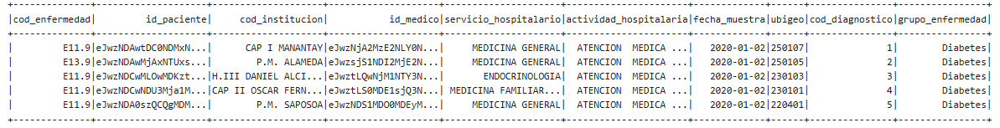
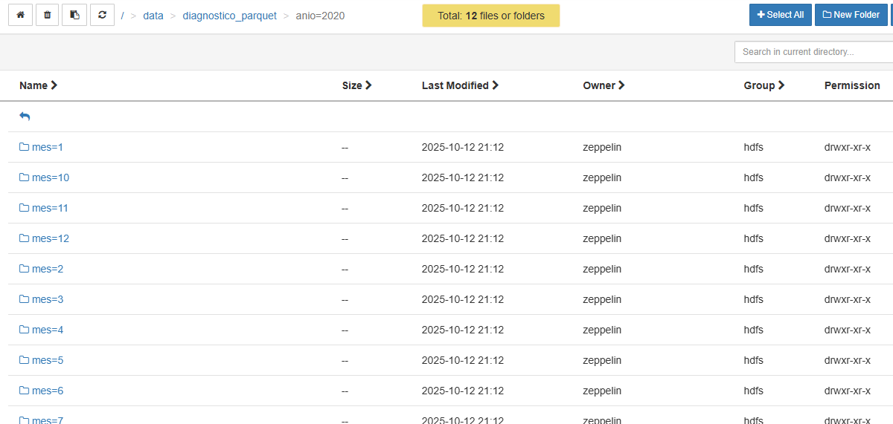

# 11. TRANSFORMACIONES EN SPARK

## 11.1. Pipeline de limpieza y enriquecimiento (detalles de transformaciones)

### 11.1.1. Carga de DataFrames

Se cargaron las siguientes fuentes de datos para la conformación del modelo analítico:

- **CIE10_2021.csv**  


- **DF_ExLab_CExt_Diabetes.csv**

- **DF_ExLab_CExt_EnfermedadRenal.csv**  


- **DF_ExLab_CExt_Hiperlipidemia.csv**  


- **geodir_ubigeo_inei_ubigeo_inei.csv**


---

### 11.1.2. Limpieza de DataFrames

#### a) df_CIE

**Transformaciones realizadas:**  
Solo se cambió el formato de nombre en las columnas.

**Código:**
```python
df_CIE = df_CIE.withColumnRenamed("CODIGO", "cod_enfermedad") \
.withColumnRenamed("DESCRIPCION", "des_enfermedad")
```
**Resultado:**  


---

#### b) df_Diabetes

Esta tabla se normalizó para obtener las tablas derivadas:  
**Procedimiento**, **Resultado_Diagnostico**, **Medico** y **Paciente**.

**Código:**

Para poner en formato la tabla df_Diabetes:
```
from pyspark.sql.functions import col, row_number, monotonically_increasing_id  
from pyspark.sql.window import Window  
from pyspark.sql.functions import to_date, col  

# Creamos una ventana sin partición ni orden específico  
windowSpec = Window.orderBy(monotonically_increasing_id())  

df_Diabetes_main = df_Diabetes.select(  
    col("COD_DIAG").alias("cod_enfermedad"),  
    col("ID_PACIENTE").alias("id_paciente"),  
    col("IPRESS").alias("cod_institucion"),  
    col("ID_MEDICO").alias("id_medico"),  
    col("SERVICIO_HOSPITALARIO").alias("servicio_hospitalario"),  
    col("ACTIVIDAD_HOSPITALARIA").alias("actividad_hospitalaria"),  
    col("FECHA_MUESTRA").alias("fecha_muestra")  
)  

# Añadimos cod_diagnostico como número incremental  
df_Diabetes_main = df_Diabetes_main.withColumn(  
    "cod_diagnostico", row_number().over(windowSpec)  
)  

# Corregimos la fecha  
df_Diabetes_main = df_Diabetes_main.withColumn(  
    "fecha_muestra",  
    to_date(col("fecha_muestra").cast("string"), "yyyyMMdd")  
)  
```
---

**Para crear la tabla Procedimiento:**
```python
from pyspark.sql import Window  
from pyspark.sql.functions import col, row_number, monotonically_increasing_id  

df_proc1 = df_Diabetes.select(col("PROCEDIMIENTO_1").alias("des_procedimiento")).distinct()  
df_proc2 = df_Diabetes.select(col("PROCEDIMIENTO_2").alias("des_procedimiento")).distinct()  

windowSpec = Window.orderBy(monotonically_increasing_id())  

df_Procedimiento = (  
    df_proc1  
    .unionByName(df_proc2)  
    .distinct()  
    .withColumn("cod_procedimiento", row_number().over(windowSpec))  
    .select("cod_procedimiento", "des_procedimiento")  
)
```
---

**Para crear la tabla Resultado_Diagnostico:**
```python
from pyspark.sql.functions import col, to_date  

df_joined = df_Diabetes_main.join(  
    df_Diabetes,  
    ["id_paciente", "id_medico", "fecha_muestra"],  
    "inner"  
)  

df_res1 = df_joined.select(  
    col("cod_diagnostico"),  
    col("PROCEDIMIENTO_1").alias("des_procedimiento"),  
    col("RESULTADO_1").alias("resultado"),  
    col("UNIDADES_1").alias("unidades"),  
    col("FEC_RESULTADO_1").alias("fecha_resultado")  
)  

df_res2 = df_joined.select(  
    col("cod_diagnostico"),  
    col("PROCEDIMIENTO_2").alias("des_procedimiento"),  
    col("RESULTADO_2").alias("resultado"),  
    col("UNIDADES_2").alias("unidades"),  
    col("FEC_RESULTADO_2").alias("fecha_resultado")  
)  

df_Resultado_Procedimiento_temp = df_res1.unionByName(df_res2).distinct()  

df_Resultado_Procedimiento = df_Resultado_Procedimiento_temp.join(  
    df_Procedimiento,  
    on=["des_procedimiento"],  
    how="left"  
).select(  
    "cod_diagnostico",  
    "cod_procedimiento",  
    "resultado",  
    "unidades",  
    "fecha_resultado"  
)  

df_Resultado_Procedimiento = df_Resultado_Procedimiento.withColumn(  
    "fecha_resultado",  
    to_date(col("fecha_resultado").cast("string"), "yyyyMMdd")  
)
```
---

**Para crear la tabla Medico:**
```python
df_Medico = df_Diabetes.select(  
    col("ID_MEDICO").alias("id_medico"),  
    col("EDAD_MEDICO").alias("edad_medico")  
).distinct()
```
**Para crear la tabla Paciente:**
```python
df_Paciente = df_Diabetes.select(  
    col("ID_PACIENTE").alias("id_paciente"),  
    col("EDAD_PACIENTE").alias("edad_paciente"),  
    col("SEXO_PACIENTE").alias("sexo_paciente")  
).distinct()
```
**Resultado final:**
- df_Diabetes  


- df_Procedimiento  


- df_Resultado_Diagnostico 



- df_Medico  


- df_Paciente  


---

#### c) df_Enf_Renal

Transformaciones iguales que para Diabetes.

```python
from pyspark.sql.functions import col, row_number, monotonically_increasing_id  
from pyspark.sql.window import Window  
from pyspark.sql.functions import to_date, col  

windowSpec = Window.orderBy(monotonically_increasing_id())  
last_cod_diag = df_Diabetes_main.agg({"cod_diagnostico": "max"}).collect()[0][0]  

df_Renal_main = df_Enf_Renal.select(  
    col("COD_DIAG").alias("cod_enfermedad"),  
    col("ID_PACIENTE").alias("id_paciente"),  
    col("IPRESS").alias("cod_institucion"),  
    col("ID_MEDICO").alias("id_medico"),  
    col("SERVICIO_HOSPITALARIO").alias("servicio_hospitalario"),  
    col("ACTIVIDAD_HOSPITALARIA").alias("actividad_hospitalaria"),  
    col("FECHA_MUESTRA").alias("fecha_muestra")  
)  

df_Renal_main = df_Renal_main.withColumn(  
    "cod_diagnostico", row_number().over(windowSpec) + last_cod_diag  
)  

df_Renal_main = df_Renal_main.withColumn(  
    "fecha_muestra",  
    to_date(col("fecha_muestra").cast("string"), "yyyyMMdd")  
)
```
**Resultado:**

---

#### d) df_Hiperlipidemia

Transformaciones iguales que para Diabetes.
```python
from pyspark.sql.functions import col, row_number, monotonically_increasing_id  
from pyspark.sql.window import Window  
from pyspark.sql.functions import to_date, col  

windowSpec = Window.orderBy(monotonically_increasing_id())  
last_cod_diag = df_Renal_main.agg({"cod_diagnostico": "max"}).collect()[0][0]  

df_Hiperlipidemia_main = df_Hiperlipidemia.select(  
    col("COD_DIAG").alias("cod_enfermedad"),  
    col("ID_PACIENTE").alias("id_paciente"),  
    col("IPRESS").alias("cod_institucion"),  
    col("ID_MEDICO").alias("id_medico"),  
    col("SERVICIO_HOSPITALARIO").alias("servicio_hospitalario"),  
    col("ACTIVIDAD_HOSPITALARIA").alias("actividad_hospitalaria"),  
    col("FECHA_MUESTRA").alias("fecha_muestra")  
)  

df_Hiperlipidemia_main = df_Hiperlipidemia_main.withColumn(  
    "cod_diagnostico", row_number().over(windowSpec) + last_cod_diag  
)  

df_Hiperlipidemia_main = df_Hiperlipidemia_main.withColumn(  
    "fecha_muestra",  
    to_date(col("fecha_muestra").cast("string"), "yyyyMMdd")  
)
```

**Resultado:**


---

#### e) df_Geodir

Se eliminaron columnas no relevantes y se renombraron las columnas principales.
```python
df_Geodir = df_Geodir.select(  
    col("Ubigeo").alias("ubigeo"),  
    col("Distrito").alias("distrito"),  
    col("Provincia").alias("provincia"),  
    col("Departamento").alias("departamento"),  
    col("Poblacion").alias("poblacion")  
)
```
**Resultado:**


---

#### f) Unificación

- Diagnósticos

* Unificacion de diagnósticos

```python
df_diagnostico = (  
    df_Diabetes_main  
    .unionByName(df_Renal_main)  
    .unionByName(df_Hiperlipidemia_main)  
)
```



- Pacientes

* Unificación de pacientes

```python
df_Paciente_final = (
    df_Paciente_final
    .unionByName(df_pacientes_extra)
    .dropDuplicates(["id_paciente"])
)
```


* Se agrega grupo etario

```python
from pyspark.sql import functions as F

df_paciente = df_paciente.withColumn(
    "grupo_etario",
    F.when(F.col("edad_paciente") < 5, "Menor de 5 años")
     .when((F.col("edad_paciente") >= 5) & (F.col("edad_paciente") <= 11), "Niñez (5-11)")
     .when((F.col("edad_paciente") >= 12) & (F.col("edad_paciente") <= 17), "Adolescencia (12-17)")
     .when((F.col("edad_paciente") >= 18) & (F.col("edad_paciente") <= 29), "Joven adulto (18-29)")
     .when((F.col("edad_paciente") >= 30) & (F.col("edad_paciente") <= 59), "Adulto (30-59)")
     .otherwise("Adulto mayor (60+)")  # >=60
)
```


---

## 11.2. Esquemas, particiones y propiedades de tablas

### 11.2.1. Exportando las tablas limpias como archivos CSV

Código:
```python
output_path = "/data/final/"

df_diagnostico.coalesce(1).write.mode("overwrite").option("header", "true").csv(output_path + "diagnostico")  
df_paciente.coalesce(1).write.mode("overwrite").option("header", "true").csv(output_path + "paciente")  
df_medico.coalesce(1).write.mode("overwrite").option("header", "true").csv(output_path + "medico")  
df_resultado_procedimiento.coalesce(1).write.mode("overwrite").option("header", "true").csv(output_path + "resultado_procedimiento")  
df_procedimiento.coalesce(1).write.mode("overwrite").option("header", "true").csv(output_path + "procedimiento")  
df_ubigeo.coalesce(1).write.mode("overwrite").option("header", "true").csv(output_path + "ubigeo")  
df_ipress.coalesce(1).write.mode("overwrite").option("header", "true").csv(output_path + "ipress")  
df_CIE.coalesce(1).write.mode("overwrite").option("header", "true").csv(output_path + "cie")
```

**Resultado:**  


---

### 11.2.2. Exportando las tablas limpias como archivos Spark con formato Parquet

Se realizaron exportaciones adicionales en formato Parquet, aprovechando su compresión y optimización para análisis distribuidos.

```python
from pyspark.sql import functions as F

# Agregamos columnas de año y mes
df_parquet = df_diagnostico.withColumn("anio", F.year("fecha_muestra")) \
                            .withColumn("mes", F.month("fecha_muestra"))

# Guardamos en Parquet particionado por año y mes
output_path = "/data/final/diagnostico_parquet/"

df_parquet.write.mode("overwrite") \
        .partitionBy("anio", "mes") \
        .parquet(output_path)
```

**Particiones de datos:**
- Por año


- Por mes




---
