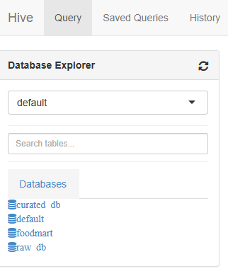
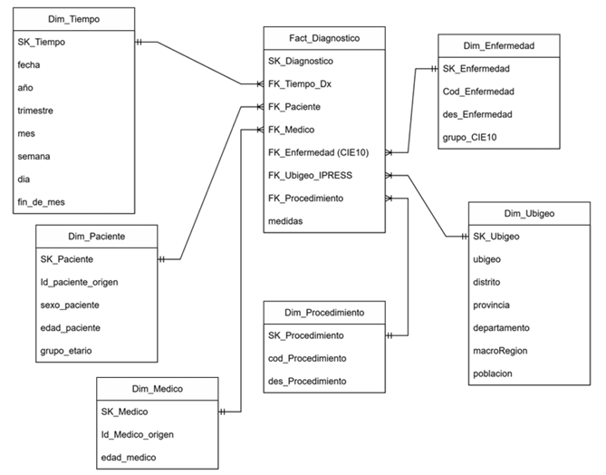

# 12. TABLAS, CUBOS Y MODELOS OLAP

## 12.1. Diseño de tablas Fact/Dimension

### 12.1.1. Preparación inicial de data

**Creación de la tabla:**

```python
df_fact = (  
df_diagnostico  
.join(df_paciente, "id_paciente", "left")  
.join(df_resultado_procedimiento, "cod_diagnostico", "left")  
.join(df_procedimiento, "cod_procedimiento", "left")  
.join(df_ipress, "cod_institucion", "left")  
.join(df_ubigeo, "ubigeo", "left")  
.join(df_CIE, "cod_enfermedad", "left")  
)
```
---

**Selección de columnas relevantes:**
```python
df_fact = df_fact.select(  
    "cod_diagnostico",  
    "id_paciente",  
    "sexo_paciente",  
    "grupo_etario",  
    "cod_institucion",  
    "nombre",  
    "departamento",  
    "red",  
    "cod_enfermedad",  
    "des_enfermedad",  
    "des_procedimiento",  
    "resultado",  
    "unidades",  
    "fecha_resultado"  
)
```
---

**Limpieza final:**
```python
%pyspark  
df_fact = df_fact.dropna(subset=["resultado"])
```
---

### 12.1.2. Comparación Raw vs Curated

**Código:**
```python
# RAW  
df_diagnostico.write.mode("overwrite").parquet("/user/hive/warehouse/raw/diagnostico")  

# CURATED  
df_fact.write.mode("overwrite").partitionBy("departamento").parquet("/user/hive/warehouse/curated/fact_diagnostico")
```
---

## 12.2. Integración con Hive

### A) Creación y visualización de bases de datos en Apache Spark con PySpark

En esta etapa, se muestra el proceso de creación y verificación de bases de datos dentro del metastore de Hive utilizando PySpark.  
El propósito es estructurar las diferentes capas de almacenamiento del modelo de datos del proyecto: **raw** (cruda) y **curated** (depurada).  
Esto facilita la organización, trazabilidad y posterior análisis de la información en entornos Big Data.

```python
%pyspark  
spark.sql("SHOW DATABASES").show()
```

El comando `%pyspark` indica que el intérprete usado es PySpark dentro del entorno Zeppelin.  
La instrucción `spark.sql("SHOW DATABASES")` ejecuta una sentencia SQL para listar las bases registradas en el metastore.

**Resultado inicial:**

| databaseName |
|---------------|
| default       |
| foodmart      |

Inicialmente se observan dos bases de datos:
- **default:** creada por defecto por Spark.  
- **foodmart:** base de datos de ejemplo utilizada para pruebas en entornos analíticos.

---

**Inicialización de la sesión de Spark con soporte Hive:**

```python
%pyspark  
from pyspark.sql import SparkSession  
spark = (  
SparkSession.builder  
.appName("Proyecto_OLAP")  
.config("spark.sql.warehouse.dir", "/tmp/hive_warehouse")  # ruta donde se permite escribir  
.enableHiveSupport()  
.getOrCreate()  
)
```

En este bloque se inicializa una sesión de Spark denominada *Proyecto_OLAP*, conectada al metastore de Hive mediante `.enableHiveSupport()`.  
El atributo `.config("spark.sql.warehouse.dir", "/tmp/hive_warehouse")` define la ruta del warehouse donde se almacenarán las tablas y bases creadas.  
De esta manera, Spark actúa como un motor SQL distribuido con capacidad de persistir estructuras tipo Hive.

---

**Creación de bases de datos:**

```python
%pyspark  
spark.sql("CREATE DATABASE IF NOT EXISTS raw_db")  
spark.sql("CREATE DATABASE IF NOT EXISTS curated_db")
```

Se crean dos bases de datos que representan las capas principales del flujo de datos:
- **raw_db:** almacena los datos sin procesar.  
- **curated_db:** almacena los datos limpios y listos para análisis.  

El uso de `IF NOT EXISTS` evita errores si las bases ya existen.

---

**Verificación:**

```python
%pyspark  
spark.sql("SHOW DATABASES").show()
```

**Resultado:**

| databaseName |
|---------------|
| curated_db    |
| default       |
| foodmart      |
| raw_db        |

**Prueba**

 

El resultado confirma la creación satisfactoria de las nuevas bases de datos **raw_db** y **curated_db**, ahora disponibles en el catálogo del metastore de Hive para posteriores procesos ETL y modelado.

---

### B) Carga de tablas en las bases de datos Hive con PySpark

Una vez creadas las bases de datos, se procede a la carga de los DataFrames hacia las tablas correspondientes.  
Esto permite persistir la información en formato estructurado dentro del entorno Spark para su reutilización en análisis posteriores.

```python
%pyspark  
df_diagnostico.write.mode("overwrite").saveAsTable("raw_db.diagnostico")  
df_paciente.write.mode("overwrite").saveAsTable("raw_db.paciente")  
df_medico.write.mode("overwrite").saveAsTable("raw_db.medico")  
df_resultado_procedimiento.write.mode("overwrite").saveAsTable("raw_db.resultado_procedimiento")  
df_procedimiento.write.mode("overwrite").saveAsTable("raw_db.procedimiento")  
df_ipress.write.mode("overwrite").saveAsTable("raw_db.ipress")  
df_CIE.write.mode("overwrite").saveAsTable("raw_db.cie")  
df_ubigeo.write.mode("overwrite").saveAsTable("raw_db.ubigeo")
```

Cada línea escribe un DataFrame de PySpark en el catálogo de Hive, convirtiéndolo en una tabla persistente dentro de la base **raw_db**.  

**Funciones clave:**
- `write`: inicia el proceso de escritura.  
- `mode("overwrite")`: reemplaza el contenido existente, asegurando la versión más reciente.  
- `saveAsTable("base.tabla")`: guarda la tabla en el metastore con el nombre especificado.  

Estas tablas conforman la **capa Raw Layer**, donde se conserva la información original.

---

**Creación de tabla en capa Curated:**

%pyspark  
df_fact.write.mode("overwrite").saveAsTable("curated_db.fact_diagnostico")

El DataFrame `df_fact`, con la información consolidada, se almacena en **curated_db.fact_diagnostico**, representando una **tabla de hechos** dentro del modelo analítico.  
El modo `overwrite` garantiza que los datos se actualicen completamente.  
Esta tabla servirá como base para análisis OLAP, reportes y visualizaciones.

---

**Enriquecimiento temporal:**

```python
from pyspark.sql import functions as F  
df_fact = df_fact.withColumn("anio", F.year("fecha_resultado"))  
df_fact = df_fact.withColumn("mes", F.month("fecha_resultado"))
```

Aquí se agregan dos columnas al DataFrame:  
- **anio:** año de la fecha del resultado.  
- **mes:** mes de la fecha del resultado.  

Estas variables permiten segmentar los análisis por periodos temporales, fundamentales para modelos OLAP y tableros de control.

---

## 12.2. Esquema estrella físico y diagramas

La estructura de datos se organizó bajo el modelo **estrella (Star Schema)**, en donde:
- La **tabla de hechos** centraliza las métricas del negocio (diagnósticos, resultados, etc.).
- Las **tablas dimensión** describen los ejes de análisis (paciente, médico, procedimiento, institución, tiempo).



---

## 12.3. Creación del cubo OLAP inicial

**Hecho:**  
La tabla `df_fact` representa el **hecho principal** del sistema analítico.  
El hecho corresponde al diagnóstico médico realizado a un paciente, evento cuantificable y medible.

---

**Dimensiones:**

Las dimensiones constituyen los ejes por los cuales se puede analizar el hecho.  
En este cubo, se incluyen las siguientes dimensiones principales:

| Dimensión        | Descripción                                                        | Ejemplo de uso |
|------------------|--------------------------------------------------------------------|----------------|
| **Grupo_Etario** | Agrupa pacientes por rangos de edad (niño, joven, adulto, mayor).  | Analizar cómo varía el diagnóstico por grupo etario. |
| **Departamento** | Ubicación geográfica del diagnóstico.                              | Comparar resultados entre departamentos del país. |
| **Des_Enfermedad** | Nombre o descripción de la enfermedad (según CIE).               | Ver qué enfermedades son más frecuentes por región o edad. |
| **Mes y Año**     | Dimensión temporal para analizar tendencias en el tiempo.          | Comparar evolución de enfermedades por mes/año. |

---

Con este diseño, se facilita la creación de **cubos OLAP** capaces de responder consultas multidimensionales, tales como:
- Cantidad de diagnósticos por departamento y grupo etario.  
- Promedio de resultados por mes y enfermedad.  
- Distribución de casos por institución de salud o red asistencial.

Este modelo constituye la base analítica del sistema, integrando de manera coherente las dimensiones y hechos para análisis avanzados de salud pública.

---

Se adjunta un documento formato pdf con todo el código ejecutado en Zeppelin Notebook
[Zeppelin Notebook](../Ejecucion.pdf)
