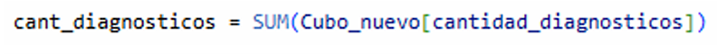
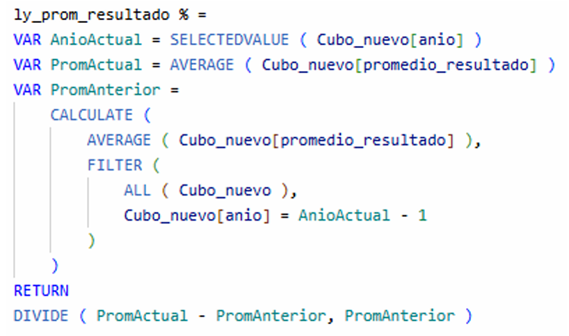
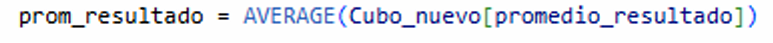
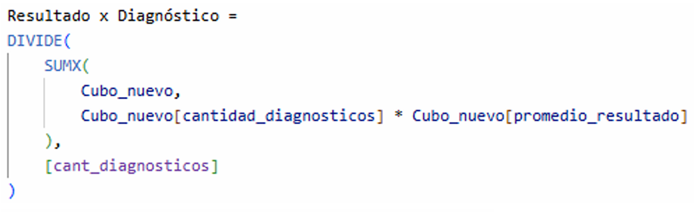
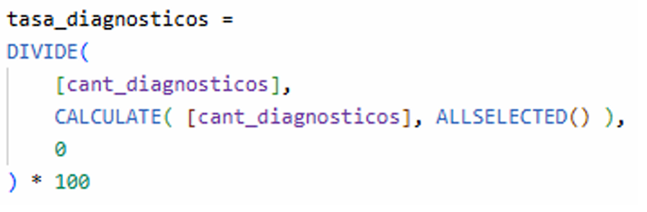
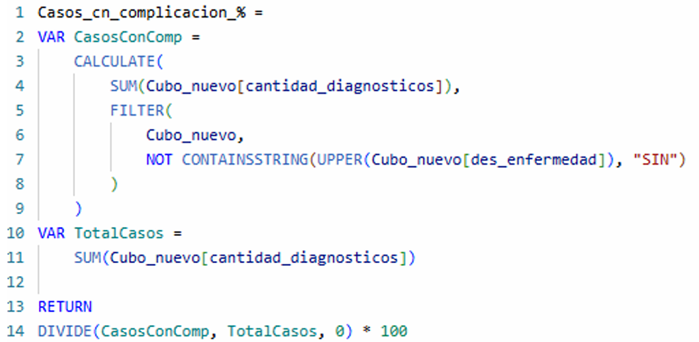
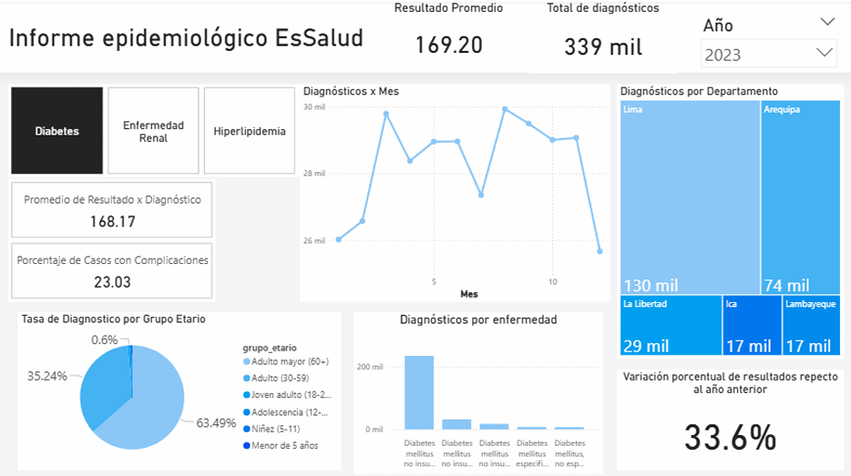

# DASHBOARD PRELIMINAR Y CONSUMO  

## 13.1. Implementación: Power BI  

Se utilizó **Power BI** como herramienta principal para la visualización de datos y la creación del tablero analítico.  
El objetivo de esta etapa fue representar de manera gráfica la relación entre las distintas variables del modelo y destacar los indicadores clave de negocio derivados del proceso ETL y del modelo OLAP previamente construido.  

El dashboard permite observar de forma interactiva el comportamiento de los diagnósticos médicos, su distribución por grupo etario, departamento, enfermedad y periodo temporal (año/mes).  
Asimismo, facilita la identificación de tendencias y comparaciones entre diferentes dimensiones analíticas.  

---

### 13.1.1. Fórmulas utilizadas  

Las principales medidas y cálculos implementados en Power BI fueron los siguientes:  

- **Cantidad de diagnósticos:**  
  Mide el número total de registros de diagnósticos en el periodo analizado. 
 

- **Cantidad promedio de resultado respecto al año anterior:**  
  Calcula la variación porcentual o promedio de resultados comparando el año actual con el año previo, permitiendo analizar tendencias temporales.  
 

- **Promedio de resultado:**  
  Determina el valor promedio de la variable *resultado*, lo cual permite evaluar el desempeño o evolución general de los casos.  
 

- **Resultado por diagnóstico:**  
  Relaciona el tipo de diagnóstico con el valor del resultado, posibilitando la comparación entre distintas enfermedades o categorías.  
 

- **Tasa de diagnósticos:**  
  Indica la proporción o frecuencia de diagnósticos en relación con el total de registros, sirviendo como métrica para evaluar incidencia o prevalencia. 
 

- **Casos con complicación:**
  Indica el porcentaje de casos críticos respecto a los demás
 

Cada una de estas medidas fue creada mediante el editor DAX (Data Analysis Expressions) de Power BI, asegurando su actualización dinámica al aplicar filtros o segmentaciones en el tablero.

---

## 13.2. Capturas y archivo Power BI  

En esta sección se presentan las **capturas del dashboard** desarrollado, mostrando la disposición de gráficos, indicadores y filtros principales.  

 

El archivo es: 
**[Archivo de Power BI](https://drive.google.com/file/d/1iCQBayL-tl1GVPi9qSzdq5yYEUjs1k18/view?usp=drive_link)**
  
### Archivo alojado en Google Drive

El archivo original pesa **50 MB**, y GitHub solo permite subir archivos de hasta **25 MB**.  
Por eso, lo hemos guardado en Google Drive.

Este archivo contiene las conexiones al modelo de datos generado en la capa *curated* del entorno Hadoop/Hive, integrando los resultados transformados del proceso analítico.  
