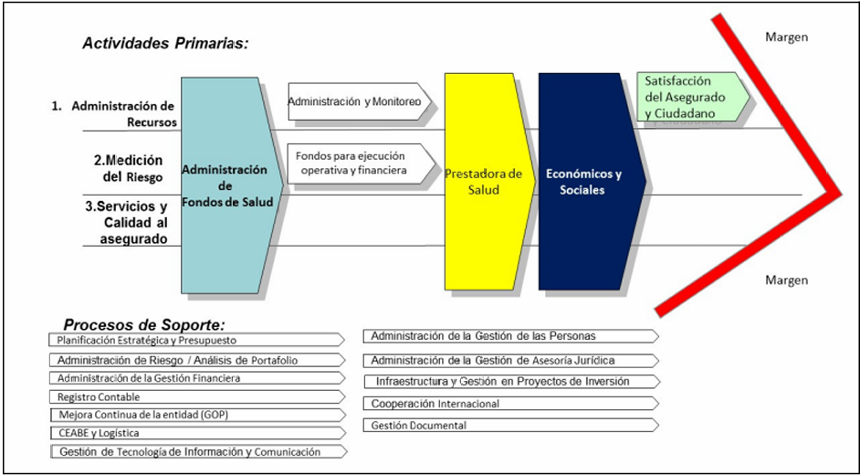

# ANÁLISIS ORGANIZACIONAL

## 2.1. Organigrama y Roles Clave

### Organigrama

El organigrama de **EsSalud** muestra una **estructura jerárquica amplia y especializada** que integra órganos de alta dirección, gerencias centrales, oficinas y subgerencias distribuidas por funciones estratégicas, asistenciales y de apoyo.  

Esta organización busca garantizar una **gestión coordinada** de los servicios de salud, aseguramiento, información y planificación institucional a nivel nacional.

---

### Roles Clave

Los roles clave se concentran en las áreas de **Planeamiento**, **Prestaciones de Salud**, **Inteligencia Sanitaria** y **Gestión de la Información**, responsables de **analizar datos, definir indicadores y ejecutar acciones preventivas** frente a enfermedades crónicas.  

Estas unidades trabajan de forma articulada para transformar la información institucional en **estrategias efectivas de prevención** y mejora de la salud pública.

| **Nivel / Unidad** | **Rol Clave** | **Función dentro del caso (centrada en la gestión y uso de información)** |
|---------------------|----------------|----------------------------------------------------------------------------|
| Presidencia / Gerencia General | Ejecutiva / Patrocinador Institucional | Autoriza y respalda la iniciativa de análisis predictivo como parte de la estrategia nacional de prevención de enfermedades crónicas. Facilita la coordinación intergerencial. |
| Gerencia Central de Planeamiento y Presupuesto | Gestor Estratégico de Indicadores | Define los objetivos de salud institucional y establece los KPI para medir el impacto de la prevención (reducción de diagnósticos, mejora de cobertura, eficiencia regional). |
| Gerencia de Gestión de la Información | Coordinador de Integración y Calidad de Datos | Reúne, valida y estandariza los datos provenientes de hospitales, asegurados y registros epidemiológicos para construir una base confiable de análisis. |
| Gerencia Central de Prestaciones de Salud | Unidad Usuaria Principal del Modelo Predictivo | Utiliza los resultados del análisis para diseñar estrategias de intervención temprana, priorizar regiones y orientar campañas de salud preventiva. |
| Oficina de Inteligencia e Información Sanitaria | Analista Epidemiológico y Decisor Técnico | Interpreta los datos, construye mapas de riesgo y emite reportes para la toma de decisiones clínicas y operativas. |
| Gerencia de Atención Primaria / Subgerencia de Promoción de la Salud y Prevención de Enfermedades | Ejecutor de Intervenciones Preventivas | Implementa programas de educación, control y seguimiento en zonas de mayor riesgo identificadas por el modelo. |
| Gerencia Central de Seguros y Prestaciones Económicas | Proveedor de Datos Demográficos y de Cobertura | Facilita información sobre la población asegurada (edad, sexo, ubicación, tipo de seguro) para caracterizar los grupos vulnerables. |
| Gerencia Central de Operaciones | Coordinador Regional de Implementación | Supervisa la aplicación de acciones preventivas y verifica la actuación de las redes asistenciales según prioridades geográficas. |
| Gerencia Central de Gestión Financiera | Gestor de Recursos Preventivos | Asigna presupuesto a las regiones con mayor incidencia y prioriza inversión en equipamiento, campañas y personal médico preventivo. |
| Gerencia Central de Gestión de las Personas | Gestor del Talento y Capacitación en Prevención | Promueve la formación del personal médico y técnico en manejo de datos epidemiológicos, detección temprana y educación sanitaria. |

---

## 2.2. Productos y Clientes

### A. Productos

- **Prestaciones de Salud:** Servicios médicos preventivos, asistenciales y de rehabilitación brindados en diferentes niveles de atención, orientados a preservar y recuperar la salud del asegurado.  
- **Prestaciones Económicas:** Subsidios por maternidad, lactancia, sepelio, incapacidad temporal y riesgos laborales, garantizando la protección financiera del asegurado.  
- **Prestaciones Sociales:** Programas de bienestar social, atención al adulto mayor, rehabilitación física y laboral, y apoyo a personas con discapacidad.  
- **Atención Primaria y Especializada:** Consultas médicas, exámenes diagnósticos, hospitalización, telemedicina y servicios de alta complejidad en las redes asistenciales.  
- **Programas Preventivos y de Promoción de la Salud:** Campañas de vacunación, detección temprana de enfermedades crónicas y educación sanitaria.  
- **Gestión del Aseguramiento:** Procesos de registro, acreditación y control de cobertura de asegurados y derechohabientes.  

---

### B. Clientes

- **Asegurados Regulares:** Trabajadores formales y sus derechohabientes, beneficiarios principales de los servicios de salud.  
- **Pensionistas y Jubilados:** Personas retiradas que mantienen acceso a los servicios médicos y económicos de EsSalud.  
- **Trabajadores Independientes Asegurados:** Ciudadanos que realizan aportes voluntarios para acceder a las prestaciones.  
- **Personas en Situación de Vulnerabilidad:** Adultos mayores, personas con discapacidad y grupos sociales prioritarios.  
- **Empleadores y Empresas:** Instituciones públicas o privadas que financian el seguro social y gestionan la afiliación de su personal.  
- **Instituciones del Estado y Aliados Estratégicos:** Entidades gubernamentales que colaboran con EsSalud en campañas, convenios y proyectos de salud pública.  

---

## 2.3. Cadena de Valor

La **cadena de valor de EsSalud** representa cómo la institución organiza y articula sus procesos **primarios y de soporte** para cumplir su misión de brindar **prestaciones integrales de salud, económicas y sociales**, orientadas a la **satisfacción del asegurado** y del ciudadano.

---

## 2.4. Procesos Principales y Secundarios

### 2.4.1. Actividades Primarias

#### a. Administración de Recursos
- Planificación, asignación y gestión eficiente de los recursos económicos, humanos y materiales.  
- Garantiza la disponibilidad de fondos y la sostenibilidad del sistema.  
- Relacionada con la función de **Administración y Monitoreo** dentro de la gestión financiera.

#### b. Medición del Riesgo
- Evalúa y controla los riesgos relacionados con salud, atención y sostenibilidad financiera.  
- Incluye análisis actuarial y de portafolio para ajustar estrategias.  
- Base para la **Administración de Fondos de Salud**.

#### c. Servicios y Calidad al Asegurado
- Parte operativa y asistencial donde se materializa la atención de salud.  
- A través de la Prestadora de Salud, administra servicios médicos, preventivos y hospitalarios.  
- Busca **eficiencia, oportunidad y calidad** en la atención.

---

### 2.4.2. Actividades de Soporte

- **Planificación Estratégica y Presupuesto:** Define metas institucionales y asignación de recursos.  
- **Administración de Riesgo / Gestión Financiera / Registro Contable:** Control interno y transparencia económica.  
- **Gestión de Personas y Asesoría Jurídica:** Desarrolla talento humano y asegura legalidad operativa.  
- **Gestión TIC:** Facilita transformación digital, interoperabilidad y automatización.  
- **Infraestructura y Proyectos de Inversión:** Mejora continua de hospitales, redes y equipamiento.  
- **Gestión Documental y Logística:** Trazabilidad, almacenamiento y eficiencia administrativa.  
- **Cooperación Internacional y Mejora Continua:** Promueve innovación y aprendizaje institucional.

---

## 2.5. Mapa de Procesos

Los procesos representan el **eje estructural** que articula la gestión institucional y permite alinear la estrategia con la prestación efectiva de servicios.  

Se organizan en **tres niveles**:

---

### A. Procesos Estratégicos

- **Gestión de Planificación Estratégica:** Define objetivos, metas y planes institucionales alineados a políticas nacionales.  
- **Gestión de Modernización:** Promueve la innovación y mejora continua.  
- **Gestión de Riesgos:** Identifica y mitiga riesgos operativos o financieros.  
- **Gestión de la Calidad:** Asegura estándares de calidad en todos los servicios.  
- **Gestión de Imagen Institucional:** Fortalece comunicación y reputación institucional.  
- **Control Interno:** Supervisa ejecución de procesos y garantiza integridad.

---

### B. Procesos Misionales

- **Gestión de Aseguramiento en Salud:** Administra registro, control y cobertura de asegurados.  
- **Prestaciones de Salud:** Atención médica, preventiva y de rehabilitación.  
- **Prestaciones Sociales:** Servicios de apoyo, bienestar y rehabilitación.  
- **Prestaciones Económicas:** Gestión de subsidios y compensaciones (maternidad, incapacidad, sepelio, etc.).

---

### C. Procesos de Soporte

- **Gestión Logística:** Adquisición, almacenamiento y distribución de bienes y servicios.  
- **Gestión Financiera:** Control económico, presupuestos y rendición de cuentas.  
- **Gestión del Capital Humano:** Selección, capacitación y bienestar del personal.  
- **Gestión Jurídica:** Garantiza
