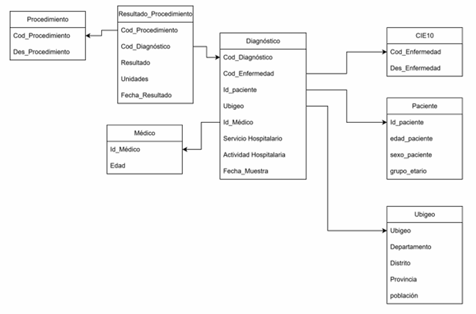

# 7. MODELO DE DATOS

## 7.1. Modelo conceptual (Esquema estrella — diagrama)

El modelo de datos propuesto se estructura bajo un **esquema estrella (star schema)**, centrado en la **tabla de hechos `Fact_Diagnostico`**, la cual almacena los eventos de diagnóstico registrados en las consultas externas de **EsSalud**.

Alrededor de esta tabla se ubican las **dimensiones descriptivas**, que permiten analizar los indicadores (KPI) desde diferentes perspectivas: tiempo, paciente, médico, enfermedad, IPRESS, ubicación y procedimiento.

> **Tabla de hechos central:** `Fact_Diagnostico`  
> **Dimensiones relacionadas:** `Dim_Tiempo`, `Dim_Paciente`, `Dim_Medico`, `Dim_Enfermedad`, `Dim_Ubigeo_IPRESS`, `Dim_Procedimiento`

---

## 7.2. Hechos y dimensiones (lista detallada)

### A. Tabla de Hechos

**`Fact_Diagnostico`**  
Contiene los eventos cuantificables de diagnóstico de enfermedades crónicas (*diabetes, hipertensión, obesidad*).  
Cada registro representa un **diagnóstico realizado a un paciente** en una fecha determinada.

**Claves foráneas (dimensiones):**
- `FK_Tiempo_Dx`
- `FK_Paciente`
- `FK_Medico`
- `FK_Enfermedad`
- `FK_Ubigeo_IPRESS`
- `FK_Procedimiento`

---

### B. Tablas de Dimensiones

| **Dimensión** | **Descripción / Propósito** |
|----------------|------------------------------|
| **Dim_Tiempo** | Permite analizar las métricas por año, trimestre, mes, semana o día. |
| **Dim_Paciente** | Describe características demográficas del paciente: sexo, edad y grupo etario. |
| **Dim_Medico** | Identifica al especialista que realiza el diagnóstico. |
| **Dim_Enfermedad (CIE10)** | Clasifica las enfermedades por código y grupo según la Clasificación Internacional de Enfermedades (CIE-10). |
| **Dim_Ubigeo** | Describe la localización geográfica (distrito, provincia, departamento) e incluye la población para calcular tasas por 1000 habitantes. |
| **Dim_Procedimiento** | Contiene los procedimientos médicos o exámenes asociados al diagnóstico. |

---

## 7.3. Atributos, jerarquías y granularidad

### A. Atributos principales por dimensión

| **Dimensión** | **Atributos relevantes** |
|----------------|---------------------------|
| **Dim_Tiempo** | `fecha`, `año`, `trimestre`, `mes`, `semana`, `día`, `fin_de_mes` |
| **Dim_Paciente** | `id_paciente_origen`, `sexo_paciente`, `edad_paciente`, `grupo_etario` |
| **Dim_Medico** | `id_medico_origen`, `edad_medico` |
| **Dim_Enfermedad** | `cod_enfermedad`, `des_enfermedad`, `grupo_CIE10` |
| **Dim_Ubigeo** | `ubigeo`, `distrito`, `provincia`, `departamento`, `macroRegion`, `poblacion` |
| **Dim_Procedimiento** | `cod_procedimiento`, `des_procedimiento` |

---

### B. Jerarquías definidas

| **Dimensión** | **Jerarquía** | **Uso analítico** |
|----------------|----------------|-------------------|
| **Tiempo** | Día → Mes → Trimestre → Año | Tendencias temporales y evolución de diagnósticos. |
| **Ubigeo** | Distrito → Provincia → Departamento → Macroregión | Análisis geográfico y cálculo de tasas por 1000 hab. |
| **Paciente** | Edad → Grupo_Etario | Perfil epidemiológico y segmentación poblacional. |
| **Enfermedad** | Código CIE10 → Grupo_CIE10 | Agregación por patología o cluster; comparativos entre grupos de enfermedades. |

---

### C. Granularidad

- **Tabla de hechos (`Fact_Diagnostico`):**  
  Un diagnóstico por paciente, enfermedad y fecha (nivel más bajo de detalle).  
- **Dim_Tiempo:** un registro por día.  
- **Dim_Paciente:** un registro por paciente individual.  
- **Dim_Ubigeo:** un registro por distrito.  
- **Dim_Médico / Dim_Enfermedad / Dim_Procedimiento:** un registro por entidad de origen.

---

## 7.4. Modelo lógico / modelo relacional (tablas, claves, índices)

El modelo lógico se deriva del modelo conceptual y se implementa en una **base de datos relacional** optimizada para consultas analíticas.  
A continuación, se presenta la estructura de tablas principales, claves primarias y relaciones:

| **Tabla** | **Tipo** | **Clave primaria (PK)** | **Claves foráneas (FK)** | **Índices recomendados** |
|------------|-----------|--------------------------|----------------------------|----------------------------|
| `Fact_Diagnostico` | Hechos | `id_diagnostico` | `FK_Tiempo_Dx`, `FK_Paciente`, `FK_Medico`, `FK_Enfermedad`, `FK_Ubigeo_IPRESS`, `FK_Procedimiento` | Índices en claves foráneas y campos de fecha |
| `Dim_Tiempo` | Dimensión | `id_tiempo` | — | Índice en `fecha` |
| `Dim_Paciente` | Dimensión | `id_paciente` | — | Índice en `grupo_etario` |
| `Dim_Medico` | Dimensión | `id_medico` | — | Índice en `especialidad` (si aplica) |
| `Dim_Enfermedad` | Dimensión | `cod_enfermedad` | — | Índice en `grupo_CIE10` |
| `Dim_Ubigeo` | Dimensión | `id_ubigeo` | — | Índices en `provincia`, `departamento` |
| `Dim_Procedimiento` | Dimensión | `id_procedimiento` | — | Índice en `cod_procedimiento` |

> **Nota:** El modelo se diseña para optimizar las consultas de análisis, reportes de ocupación, diagnósticos por región, tendencias temporales y cálculo de KPIs estratégicos.

---