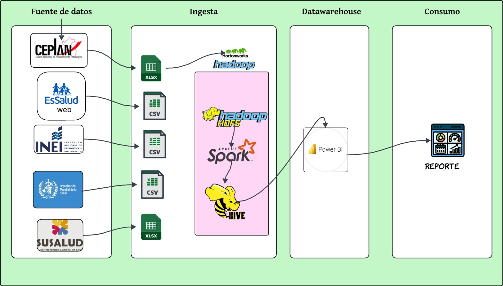

# 8. ARQUITECTURA DE SOLUCIÓN ANALÍTICA

## 8.1. Diagrama de arquitectura end-to-end

La arquitectura propuesta se compone de **cuatro capas principales**: fuente de datos, ingesta, data warehouse y consumo.  
Cada una cumple un rol específico dentro del flujo de procesamiento y análisis de la información proveniente de diversas entidades del sector salud.

### 8.1.1. Fuente de datos

En esta etapa se concentran las instituciones que generan los datos primarios sobre indicadores de salud y gestión pública.  
Entre ellas se incluyen:

- **CEPLAN** (Centro Nacional de Planeamiento Estratégico): información estratégica en formato Excel (`.xlsx`).
- **EsSalud**: datos abiertos en formato CSV desde su plataforma web.
- **INEI** (Instituto Nacional de Estadística e Informática): estadísticas sanitarias en formato CSV.
- **OMS** (Organización Mundial de la Salud): reportes internacionales descargables en CSV.
- **SUSALUD** (Superintendencia Nacional de Salud): registros administrativos en formato Excel (`.xlsx`).

Estas fuentes constituyen la base de conocimiento heterogénea a partir de la cual se construye el sistema analítico.

### 8.1.2. Ingesta

La fase de **ingesta** se encarga de la recopilación, limpieza y estandarización de los archivos provenientes de las fuentes anteriores.  
Los datos se cargan en un ecosistema **Big Data** soportado por la distribución **Hortonworks de Hadoop**, que provee la infraestructura base para el almacenamiento distribuido mediante **HDFS (Hadoop Distributed File System)**.

Sobre esta infraestructura se emplean las siguientes herramientas:

- **Apache Spark**: transformación masiva y procesamiento paralelo de datos estructurados y semiestructurados.  
- **Apache Hive**: consultas SQL sobre datos almacenados en Hadoop, facilitando la integración con herramientas analíticas.

De esta forma, los datos en formatos CSV y XLSX se unifican y se almacenan de manera estructurada dentro del ecosistema Hadoop.

### 8.1.3. Data Warehouse

Una vez procesados y depurados, los datos son almacenados en un repositorio analítico tipo **Data Warehouse**, implementado con **SQLite**.  
Este motor ligero permite la persistencia de datos consolidados y facilita la conexión directa con herramientas de inteligencia de negocio.

Posteriormente, **Power BI** se conecta al almacén de datos para la elaboración de modelos analíticos, dashboards y reportes interactivos, ofreciendo una capa de análisis accesible y visualmente comprensible.

### 8.1.4. Consumo

La última capa está orientada al **consumo de información por parte de los usuarios finales**.  
A partir de los modelos desarrollados en Power BI y los datos del Data Warehouse, se generan:

- **Páginas web interactivas**, donde se publican indicadores dinámicos.  
- **Reportes ejecutivos y cuadros de mando**, que permiten la toma de decisiones basada en evidencia.

De esta manera, la información fluye desde fuentes oficiales hasta herramientas de visualización y consulta en tiempo casi real.

---

## 8.2. Componentes: Hortonworks (HDFS, Hive), Spark, Ambari, etc.

La arquitectura de datos propuesta se sustenta sobre un ecosistema **Big Data** basado en **Hortonworks Data Platform (HDP)**, un entorno de código abierto que integra componentes del ecosistema Apache Hadoop para la gestión, procesamiento y análisis de grandes volúmenes de datos.

### 8.2.1. Hadoop Distributed File System (HDFS)

HDFS es uno de los pilares de la plataforma.  
Se trata de un sistema de archivos distribuido diseñado para almacenar grandes conjuntos de datos de manera redundante y tolerante a fallos.  
Divide los archivos en bloques y los replica en distintos nodos del clúster, asegurando alta disponibilidad.  
Su arquitectura maestro–esclavo, compuesta por un **NameNode** y múltiples **DataNodes**, permite acceso concurrente y rendimiento eficiente (Shvachko et al., 2010).

### 8.2.2. Apache Hive

**Apache Hive** actúa como un motor de almacenamiento y consulta que transforma datos estructurados alojados en HDFS en tablas accesibles mediante **HiveQL**, un lenguaje similar a SQL.  
Traduce las consultas a trabajos MapReduce o Spark, facilitando el análisis sin requerir programación distribuida.  
Además, permite crear **zonas intermedias** (*staging* y *curated*) en el proceso de refinamiento de datos (Thusoo et al., 2010).

### 8.2.3. Apache Spark

**Apache Spark** es el motor de procesamiento en memoria que reemplaza en muchos casos al modelo MapReduce tradicional.  
Permite procesamiento *batch* y *streaming*, e incluye librerías especializadas:

- **Spark SQL**
- **MLlib** (aprendizaje automático)
- **GraphX** (análisis de grafos)
- **Structured Streaming**

En esta arquitectura, Spark se utiliza para la transformación de datos en las zonas *staging* y *curated*, así como para alimentar modelos analíticos en tiempo casi real (Zaharia et al., 2016).

### 8.2.4. Apache Ambari

La administración del clúster se realiza mediante **Apache Ambari**, herramienta que proporciona una interfaz gráfica y APIs REST para instalación, configuración, monitoreo y mantenimiento del ecosistema Hadoop.  
Ambari simplifica tareas complejas como el despliegue de servicios, gestión de nodos y supervisión de métricas de rendimiento.  
Su integración con sistemas de autenticación permite una gestión segura del clúster (Apache Software Foundation, 2023).

De forma complementaria, el ecosistema puede incluir:

- **Apache Ranger**: gestión de políticas de seguridad y auditoría.  
- **Apache Atlas**: gobernanza y trazabilidad de metadatos.

En conjunto, estos componentes conforman una plataforma integral para la **gestión eficiente de datos desde su captura hasta su análisis avanzado**.

---

## 8.3. Zonas de datos: *raw / staging / curated / analytics*

La arquitectura de datos se organiza en **zonas o capas** que estructuran el flujo de información desde su origen hasta su consumo analítico.  
Cada zona cumple una función específica dentro del ciclo de vida del dato.

| Zona | Descripción |
|------|--------------|
| **Raw** | Conserva la información casi en su estado original, estructurada en HDFS. Se registran metadatos básicos y se asegura la integridad de los datos. |
| **Staging** | Limpieza, normalización y enriquecimiento mediante procesos ETL o ELT. Se eliminan duplicados e inconsistencias con herramientas como Spark y Hive. |
| **Curated** | Datos consolidados y optimizados para análisis. Es la *fuente confiable* (*single source of truth*) para reportes. |
| **Analytics** | Datasets preparados para el consumo por BI, dashboards o modelos de *machine learning*. |

---

## 8.4. Patrones de ingesta

El proceso de ingesta de datos se define según la naturaleza de las fuentes y la frecuencia de actualización.  
Se emplean tres patrones principales:

- **Batch**: procesamiento por lotes en intervalos definidos (diario o semanal). Ideal para informes históricos o estratégicos.  
- **Micro-batch**: procesamiento frecuente en intervalos cortos (minutos o segundos). Permite analítica casi en tiempo real mediante *Spark Structured Streaming* o *NiFi*.  
- **Streaming**: procesamiento continuo de flujos de datos en tiempo real, útil para monitoreo o alertas, utilizando *Kafka* o *Spark Streaming*.

Estos tres patrones pueden coexistir dentro de la arquitectura, adaptándose tanto a fuentes estáticas como a flujos dinámicos.

---

## 8.5. Seguridad, gobernanza y control de accesos

La seguridad y gobernanza de datos son pilares fundamentales del sistema.  
Se implementa un modelo **RBAC (Role-Based Access Control)** que define permisos según el perfil del usuario (analista, administrador, auditor, etc.).

- **Apache Ranger**: gestiona políticas de acceso en HDFS, Hive o Kafka, y mantiene auditorías detalladas.  
- **Apache Atlas**: proporciona un catálogo de metadatos para rastrear el linaje del dato desde su origen hasta su uso final.  
- **Kerberos**: garantiza autenticación segura.  
- **Encriptación**: se aplica tanto en tránsito como en reposo.

Con esto se asegura **confidencialidad, integridad y disponibilidad**, además del cumplimiento normativo (Apache Software Foundation, 2023).

---

## 8.6. Plan de respaldo y recuperación

El plan de respaldo y recuperación garantiza la continuidad operativa y preservación de los datos ante fallas o pérdidas.  
Incluye estrategias de **backup, retención y restauración**, definidas según la criticidad de cada zona.

- En Hadoop, los respaldos se realizan con **DistCp (Distributed Copy)**, que replica información entre clústeres.  
- **Ambari** automatiza respaldos de metadatos y configuraciones.  
- Las políticas de retención varían según el tipo de dato:
  - Zona *landing*: 7 a 30 días.
  - Zonas *curated* o *analytics*: retención de largo plazo (años).  
- El **plan de recuperación ante desastres (DR)** contempla un clúster secundario o réplica remota para minimizar la pérdida de información y tiempo de inactividad.

---