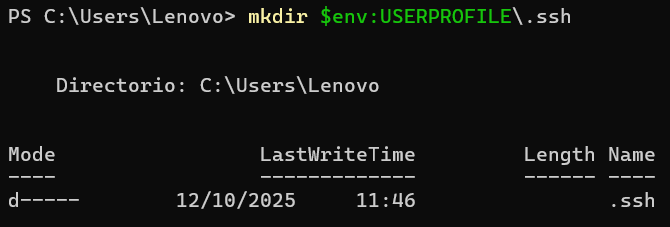
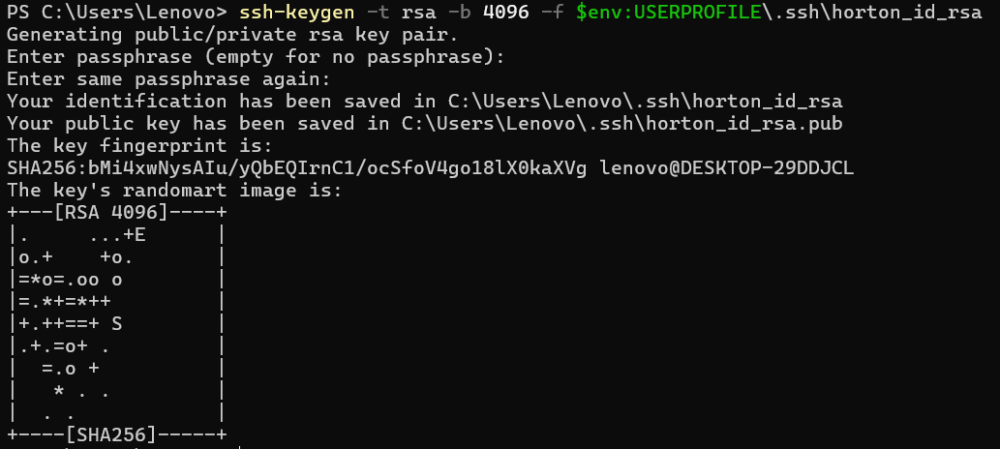
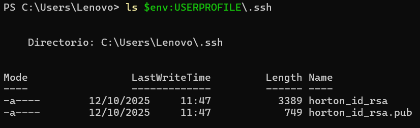
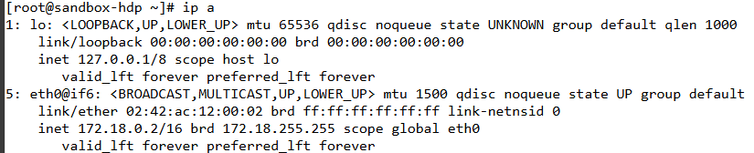
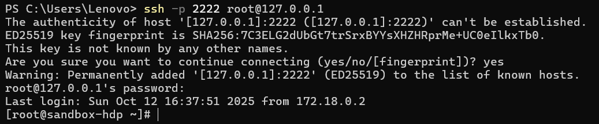
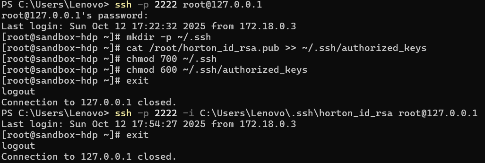
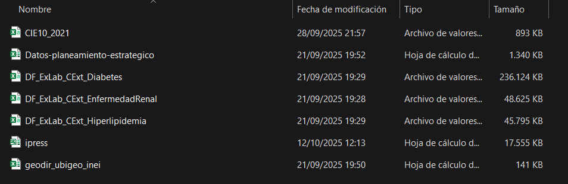
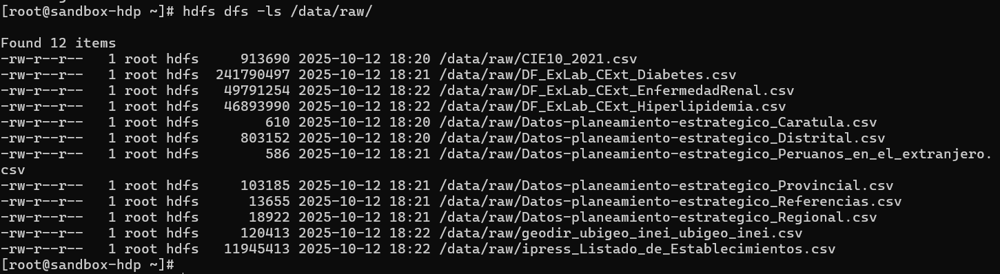

# Código para pasar archivos de la máquina local a la virtual

## Generación de clave

Para poder ingresar al entorno virtual y pasar archivos a Hortonworks tenemos que crear una clave de acceso


1. Creamos la caarpeta para almacenar la llave
```bash
mkdir $env:USERPROFILE\.ssh
```



2. Creamos las llaves de conección
```bash
ssh-keygen -t rsa -b 4096 -f $env:USERPROFILE\ssh\horton_id_rsa
```



3. Comprobamos la creación de las llaves

```bash
ls $env:USERPROFILE\.ssh
```



Donde:
* **horton_id_rsa** es la llave privada
* **horton_id_rsa.pub** es la llave pública

## Conexión a Hortonworks

1. Obtenemos la IP de la máquina virtual

```bash
ip a
```


Vemos que la ip es 127.0.0.1/8

2. Conectándose al entorno virtual desde la máquina local
```bash
ssh -p 2222 root@127.0.0.1
```



3. Ingresando la llave de acceso a la máquina virtual

```bash
mkdir -p ~/.ssh
cat /root/horton_id_rsa.pub >> ~/.ssh/authorized_keys
chmod 700 ~/.ssh
chmod 600 ~/.ssh/authorized_keys
```



Como se puede ver, ya no nos pide la contraseña del @root para entrar a la VM

## Subida de datos a Hortonworks

Tenemos los siguientes archivos para subir al HDFS del hortonworks



Se creó un archivo ```subir_a_hdfs.py```

Donde se puso el siguiente código:

1. Importación de librerías
```python
import os
import re
import unicodedata
import subprocess
import pandas as pd
```

2. Configuración
```python
KEY_PATH = r"C:\Users\Lenovo\.ssh\horton_id_rsa"
LOCAL_DIR = r"C:\Inteligencia_Negocios\Archivos\Descargados"
REMOTE_DIR = "/root/hdfs_upload"
HDFS_DIR = "/data/raw/"
SSH_CONN = "root@127.0.0.1"
SSH_PORT = "2222"
```

3. Función para limpiar nombres
```python
def limpiar_nombre(nombre):
    # Normaliza tildes y ñ
    nfkd = unicodedata.normalize("NFKD", nombre)
    sin_tildes = "".join([c for c in nfkd if not unicodedata.combining(c)])
    # Reemplaza espacios por _
    sin_espacios = sin_tildes.replace(" ", "_")
    # Elimina cualquier otro carácter raro
    limpio = re.sub(r"[^A-Za-z0-9._-]", "", sin_espacios)
    return limpio
```

4. Convertir archivos a csv
```python
print("📄 Convirtiendo archivos Excel a CSV...")
converted_files = []
for f in files:
    path = os.path.join(LOCAL_DIR, f)
    if f.endswith((".xls", ".xlsx")):
        print(f" -> {f}")
        xls = pd.ExcelFile(path)
        for sheet in xls.sheet_names:
            df = pd.read_excel(xls, sheet_name=sheet)
            clean_sheet = limpiar_nombre(sheet)
            new_name = limpiar_nombre(f"{os.path.splitext(f)[0]}_{clean_sheet}.csv")
            new_path = os.path.join(LOCAL_DIR, new_name)
            df.to_csv(new_path, index=False)
            converted_files.append(new_name)
            print(f"    |-> Hoja '{sheet}' -> {new_name}")
    else:
        converted_files.append(f)
```

5. Crear copias a la VM
```python
print("\n🚚 Copiando archivos a la VM (sandbox)...")
subprocess.run(
    ["ssh", "-p", SSH_PORT, "-i", KEY_PATH, SSH_CONN, f"mkdir -p {REMOTE_DIR}"],
    check=True,
)

for f in converted_files:
    local_path = os.path.join(LOCAL_DIR, f)
    print(f"→ Subiendo {f}")
    subprocess.run(
        [
            "scp",
            "-P",
            SSH_PORT,
            "-i",
            KEY_PATH,
            local_path,
            f"{SSH_CONN}:{REMOTE_DIR}/",
        ],
        check=True,
    )
```

6. Crear carpeta en HDFS y subir archivos
```python
print("\n📦 Subiendo archivos al HDFS...")
cmd_create_dir = f"hdfs dfs -mkdir -p {HDFS_DIR}"
cmd_put = f'for f in {REMOTE_DIR}/*; do hdfs dfs -put -f "$f" {HDFS_DIR}; done'

subprocess.run(
    ["ssh", "-p", SSH_PORT, "-i", KEY_PATH, SSH_CONN, cmd_create_dir], check=True
)
subprocess.run(["ssh", "-p", SSH_PORT, "-i", KEY_PATH, SSH_CONN, cmd_put], check=True)

print("\n✅ ¡Archivos subidos correctamente a HDFS en /data/raw/!")

```

7. Comprobamos que se hayan subido los archivos

```bash
hdfs dfs -ls /data/raw/
```

