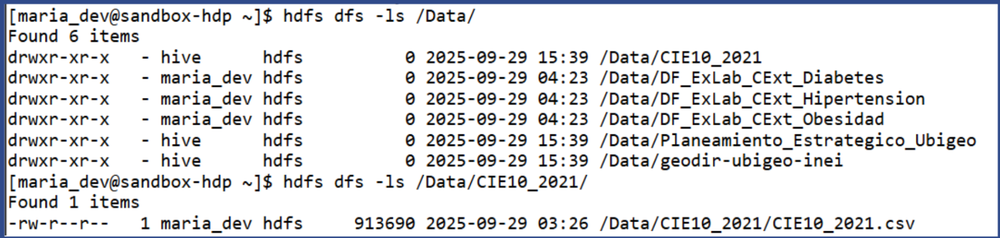
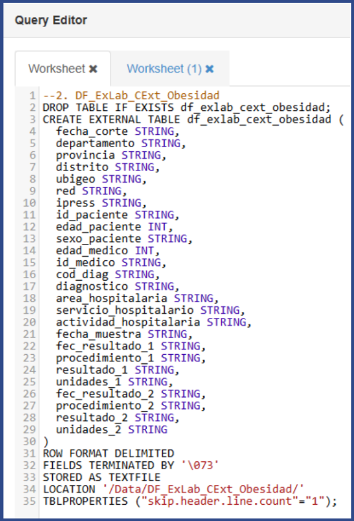
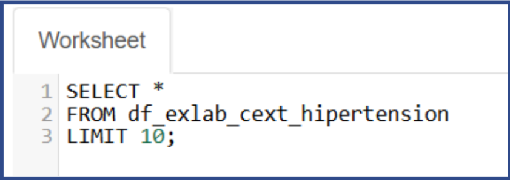
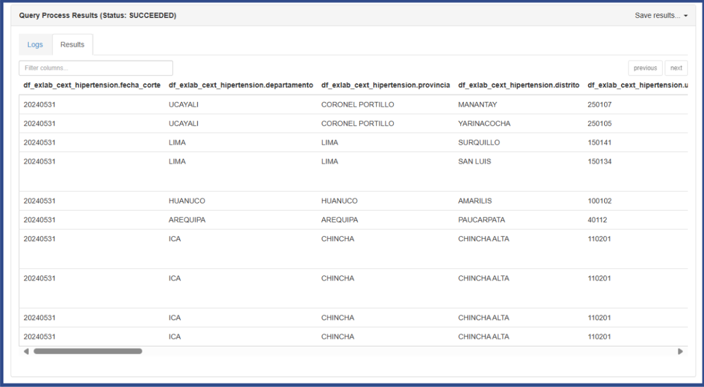

# 📊 Práctica 2 - Grupo 2

## Entregables
- [Archivo PC2](PC2-G2-INFORME.pdf)
- [PPT PC2](PC2-G2-PPT.pdf)
- [Carpeta de Querys](Querys)
 
## 🎯 Objetivos

- Aplicar la metodología Hefesto en la fase de análisis de requerimientos.  
- Identificar preguntas de negocio y traducirlas en KPIs.  
- Elaborar el modelo conceptual preliminar (hechos y dimensiones).  
- Construir el inventario de fuentes OLTP.  
- Implementar la primera ingesta de datos en Hortonworks (HDFS y Hive).  

## 1. Desarrollo

### 1.1 Preguntas del Negocio

| Área / Rol del Usuario      | Pregunta de Negocio                                                                 | Prioridad | Fuente de Datos Actual |
|-----------------------------|--------------------------------------------------------------------------------------|-----------|------------------------|
| Dirección Estratégica / Alta Dirección de EsSalud | ¿Cuál es la tasa de diagnósticos de enfermedades priorizadas (diabetes, hipertensión, obesidad) por cada 1000 habitantes? | Alta | Datos Abiertos EsSalud, CIE10 |
| Dirección Estratégica / Presidencia Ejecutiva | ¿Cómo está evolucionando la tendencia de diagnósticos en el tiempo y en qué zonas se proyecta mayor riesgo? | Alta | Datos Abiertos EsSalud, INEI |
| Gestión Táctica / Gerencias Regionales | ¿Qué regiones presentan mayor concentración de diagnósticos y cómo se distribuyen los casos por sexo y edad? | Alta | Datos Abiertos EsSalud, Ubigeo INEI |
| Gestión Táctica / Dirección de Prevención y Promoción | ¿Cuál es la edad promedio al momento del diagnóstico y cómo puede orientar las campañas preventivas? | Media | Datos Abiertos EsSalud |
| Gestión Táctica / Coordinación de Control Médico | ¿Cuánto tiempo pasa, en promedio, entre el diagnóstico inicial y el primer control posterior? | Alta | Registros hospitalarios, Datos Abiertos EsSalud |
| Gestión Operativa / Jefatura Hospitalaria | ¿Cuál es la cobertura de diagnósticos lograda por cada red hospitalaria respecto a su población asegurada? | Alta | Datos Abiertos EsSalud, RENIPRESS |
| Gestión Operativa / Unidad de Recursos Humanos | ¿Qué nivel de disponibilidad de especialistas se tiene en relación con los pacientes diagnosticados? | Media | RRHH EsSalud, RENIPRESS |

### 1.2 KPI’s Definidos

| Nombre KPI | Descripción | Fórmula | Unidad | Periodicidad | Fuente de Datos | Responsable |
|------------|-------------|---------|--------|--------------|-----------------|-------------|
| Tasa de diagnósticos por 1000 habitantes | Mide la frecuencia de diagnósticos en la población general. | (N° diagnósticos ÷ Población total) × 1000 | Casos/1000 hab. | Mensual | EsSalud, INEI | Dirección Estratégica |
| Tendencia de crecimiento de casos | Variación porcentual de diagnósticos en el tiempo. | ((Casos actual – Casos anterior) ÷ Casos anterior) × 100 | % | Mensual | EsSalud | Coordinación Epidemiológica |
| Concentración geográfica de diagnósticos | Porcentaje de casos en cada región. | (Casos región ÷ Total casos) × 100 | % | Trimestral | EsSalud, INEI | Gerencias Regionales |
| Edad promedio de diagnóstico | Edad media de pacientes al diagnóstico. | Σ Edad ÷ N pacientes | Años | Trimestral | EsSalud | Dirección de Prevención |
| Tiempo entre diagnóstico y control | Promedio de días entre diagnóstico y primer control. | Σ (Fecha control – Fecha diagnóstico) ÷ N pacientes | Días | Semestral | Hospitalarios | Control Médico |
| Distribución por sexo | Proporción de diagnósticos por sexo. | (Casos sexo ÷ Total casos) × 100 | % | Trimestral | EsSalud | Unidad de Estadística |
| Índice en población <40 años | Casos de enfermedades en menores de 40. | (Casos <40 ÷ Total casos) × 100 | % | Trimestral | EsSalud | Dirección de Epidemiología |
| Disponibilidad de especialistas | Relación médicos/pacientes. | N Médicos ÷ N Pacientes | Ratio | Trimestral | RRHH, RENIPRESS | Recursos Humanos |
| Cobertura por red hospitalaria | Diagnósticos respecto a asegurados. | (Pacientes diagnosticados ÷ Asegurados) × 100 | % | Trimestral | RENIPRESS, EsSalud | Gerencias de Red |
| Variabilidad regional | Diferencia entre la mayor y menor tasa de diagnósticos. | Máx(tasa) – Mín(tasa) | % | Trimestral | EsSalud, INEI | Dirección Estratégica |

### 1.3 Modelo Conceptual Preliminar

### 1.4 Inventario de Fuentes OLTP

| Sistema | Área Usuaria | Tipo | Tecnología | Frecuencia de actualización | Observaciones |
|---------|--------------|------|------------|-----------------------------|---------------|
| Sistema de Planeamiento Estratégico – CEPLAN | Planeamiento Estratégico | OLTP (maestro geográfico) | XLS | Anual / Semestral | Incluye descripciones y metadatos de cada ubigeo. |
| Sistema de Consultas Externas – Datos Abiertos EsSalud | Red hospitalaria / Consultas | OLTP (registros médicos) | CSV | Diario | Contiene registros de laboratorio con diagnóstico de diabetes, hipertensión y obesidad (2020–2024). |
| Sistema de Codificación Geográfica – Ubigeo (INEI) | Planeamiento / Estadística | OLTP (catálogo maestro) | CSV | Eventual | Tabla estándar para enlazar información de salud con ubicación geográfica. |
| Sistema de Clasificación Internacional de Enfermedades – CIE10 | Áreas médicas y estadística | OLTP (catálogo enfermedades) | CSV | Eventual | Contiene códigos y descripciones según CIE10. |
| RENIPRESS – Registro Nacional de Instituciones de Salud | SuSalud / Gestión infraestructura | OLTP (establecimientos de salud) | XLS | Eventual | Información oficial de hospitales, clínicas y centros de salud en Perú. |

## 2. Evidencia Técnica

### 2.1 Implementación en Hortonworks

- **Archivos cargados en HDFS**  

- Datos cargados en Ambari  

- Visualización de datos desde la consola 

- **Scripts `CREATE EXTERNAL TABLE` en Hive**

- Ejemplo: creación de tabla de **Obesidad**  

- Consulta simple en Hive y su resultado 

